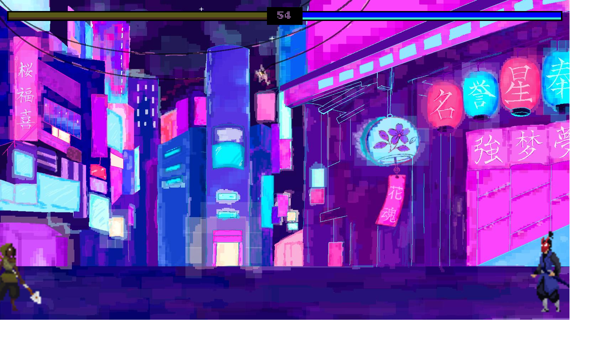

# ProjectoTps — Picchiaduro 2D stile Tekken

Picchiaduro bidimensionale per **2 giocatori in locale**, scritto in **JavaScript vanilla** con rendering su **Canvas 2D**. Progetto scolastico (TPS).



## Come si gioca

Apri `index.html` nel browser (oppure servilo in locale: `python -m http.server` e vai su `http://localhost:8000`). Servono **2 giocatori sulla stessa tastiera**.

| | Giocatore 1 | Giocatore 2 |
|---|---|---|
| Muovi | `A` / `D` | `←` / `→` |
| Salta | `W` | `↑` |
| Attacco | `H` | `ù` |
| Parata | `J` | `à` |

## Regole

- Ogni lottatore ha **vita** e **stamina**: attaccare e parare consumano stamina.
- La parata blocca i danni ma solo finché hai stamina.
- Vince chi azzera la vita dell'avversario entro i **60 secondi**; allo scadere vince chi ha più vita.

## Cosa c'è sotto il cofano

- Game loop con `requestAnimationFrame`, fisica custom (gravità, salto, hitbox di attacco).
- Sistema di sprite a stati: idle, corsa, salto, caduta, attacco, colpo subito, parata, morte.
- Collisioni attacco basate su frame dell'animazione (il colpo conta solo al frame giusto).
- HUD con barre vita/stamina e timer, schermata di fine partita.

## Struttura

```
index.html      → markup + HUD
index.js        → game loop, input, collisioni, regole
js/Classi.js    → classi Sprite e Lottatore
js/Utili.js     → timer e determinazione vincitore
img/            → sprite Player, Enemy e sfondo
```

## Stack

JavaScript (nessun framework), HTML5 Canvas, CSS.
